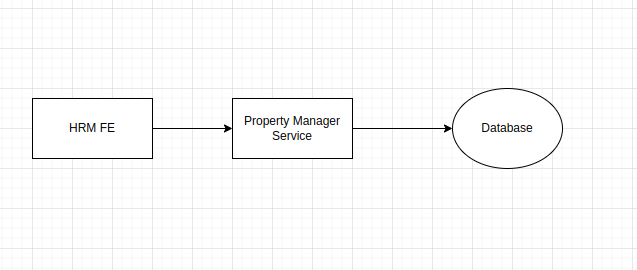

# Architecure Concept Defintion

**HRM (Home Resource Manager)** applications goal is to help me in managing resources such as Electricty, Water bills, Property taxes, etc. This will include all the ideas that arise to me as I go along developing this application. All the scope will be documented here.

## Scope

To start of with the application, initially Propery Manager module is in the scope of MVP.

## Propery Manager

The basic idea of the *Propery Manager* module is to provide the user the ability to input propery details in a form and persist to the database. After persisting the user should be able to view the propery details.

Initial Architecture Model:

